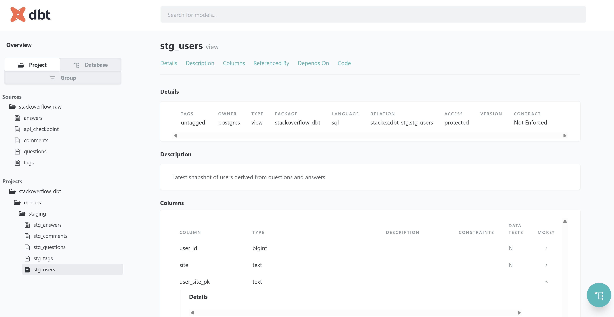

<h1> API Postgres dbt Pipeline </h1>
<h2> Tổng quan dự án </h2>

Dự án này xây dựng một end-to-end data pipeline từ việc thu thập dữ liệu qua API, lưu trữ vào PostgreSQL (local), xử lý – mô hình hóa dữ liệu bằng dbt Core, và cuối cùng phục vụ phân tích & dashboard trên Power BI.

Trọng tâm của dự án là:
* Thiết kế pipeline dữ liệu có cấu trúc rõ ràng theo chuẩn raw → staging → mart
* Thực hành dbt Core: models, tests, documentation, lineage
* Kết hợp Airflow để lập lịch và tự động hóa luồng dữ liệu

**Mục tiêu dự án**
* Hiểu rõ vai trò từng layer trong data pipeline
* Thực hành dbt Core:
    * models
    * tests
    * documentation
    * lineage
* Kết hợp Airflow + dbt trong môi trường Docker
* Xây dựng pipeline có thể mở rộng & maintain

<h2> Kiến trúc tổng thể & Flow dữ liệu </h2>

Luồng xử lý dữ liệu của dự án như sau:

**1. Airflow DAG**
* Định kỳ gọi API (StackExchange / StackOverflow)
* Kéo dữ liệu thô về PostgreSQL local
* Lưu dữ liệu vào raw schema

**2. dbt Core – Raw → Staging**
* Chạy dbt run để chuẩn hóa dữ liệu raw
* Kiểm tra chất lượng dữ liệu bằng dbt test
* Tạo các bảng staging (stg_): làm sạch, chuẩn hóa kiểu dữ liệu, logic cơ bản

**3. dbt Core – Staging → Mart**
* Xây dựng các bảng mart / fact / dimension
* Phục vụ phân tích hành vi người dùng, nội dung, mức độ tương tác

**4. BI Layer**
* Kết nối PostgreSQL với Power BI
* Sử dụng các bảng mart để xây dựng dashboard

```scss
API
 ↓
Airflow DAG (schedule)
 ↓
Postgres (raw)
 ↓
dbt Core
 ├─ raw → staging
 ├─ staging → mart
 ├─ tests
 ├─ documentation & lineage
 ↓
Postgres (analytics)
 ↓
Power BI Dashboard
```

<h2> Công nghệ sử dụng </h2>

* Airflow: Lập lịch và điều phối pipeline
* PostgreSQL: Lưu trữ dữ liệu local
* dbt Core: Biến đổi dữ liệu, test, documentation, lineage
* Docker / Docker Compose: Chuẩn hóa môi trường
* Power BI: Trực quan hóa dữ liệu

<h2> Cấu trúc thư mục </h2>

```scss
API Postgres Dbt Pipeline
│
├── airflow/
│   ├── stackex_raw_answers_dag.py
│   ├── stackex_raw_comments_dag.py
│   ├── stackex_raw_questions_dag.py
│   └── stackex_raw_tags_dag.py
│
├── infra/
│   ├── .env
│   ├── .gitignore
│   ├── Dockerfile
│   ├── docker-compose.yml
│   ├── load_env.ps1
│   ├── requirements.txt
│   └── README.md
│
├── stackoverflow_dbt/
│   ├── analyses/
│   ├── macros/
│   ├── models/
│   │   ├── raw/
│   │   ├── staging/
│   │   └── mart/
│   ├── seeds/
│   ├── snapshots/
│   ├── tests/
│   ├── dbt_project.yml
│   ├── profiles.yml
│   └── README.md
│
└── README.md
```

<h2> Airflow – Thu thập dữ liệu API </h2>

Thư mục airflow/ chứa các DAG chuyên biệt cho từng loại dữ liệu:
* `questions`
* `answers`
* `comments`
* `tags`

Mỗi DAG:
* Gọi API theo lịch
* Xử lý phân trang & rate limit
* Ghi dữ liệu nguyên bản vào PostgreSQL (raw schema)
* Không áp dụng business logic tại tầng này

Mục tiêu: raw data = phản ánh đúng dữ liệu nguồn.

<h2> dbt Core</h2>

**1. Raw layer**

* Ánh xạ trực tiếp từ bảng raw trong PostgreSQL
* Không biến đổi logic
* Dùng làm nguồn cho staging

**2. Staging layer**
* Chuẩn hóa:

    * Kiểu dữ liệu
    * Naming convention
    * Null handling
* Áp dụng logic nhẹ (deduplicate, basic filters)
* Đặt prefix stg_

**3. Mart layer**
* Thiết kế theo hướng phân tích:
    * Fact tables
    * Dimension tables
* Phục vụ trực tiếp cho BI & dashboard

<h2>dbt Tests</h2>

Sử dụng dbt tests để đảm bảo chất lượng dữ liệu:
* not_null
* unique
* relationships

<h2>dbt Documentation & Lineage</h2>

Mô tả model, column trong `src_raw.yml`, `stg_staging.yml`, `mart.yml`

Sinh tài liệu tự động:

```
dbt docs generate
dbt docs serve
```




<h2> BI & Dashboard </h2>

- Kết nối PostgreSQL với Power BI

- Sử dụng dữ liệu từ schema mart

<Updating...>